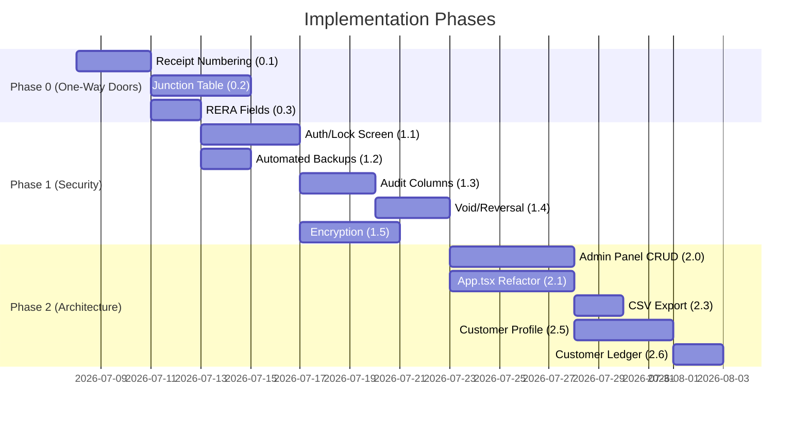

# Roadmap-Aligned To-Do List — Sukirti Developers Real Estate ERP

> **Audited against codebase** on 2026-07-08
> Items are ordered by the roadmap's suggested sequencing — "one-way doors" first, then foundational risk fixes, then feature work.

---

## Current State Summary

| Area | Status |
|---|---|
| **Frontend** | Monolithic [App.tsx](file:///Users/ketan/Live/RealEstateReceipt/src/App.tsx) (~1,800 lines). Admin panel started with basic project list/detail views |
| **Backend** | [commands.rs](file:///Users/ketan/Live/RealEstateReceipt/src-tauri/src/commands.rs) — CRUD for Projects, Towers, Units + booking/receipt workflow |
| **Database** | [db.rs](file:///Users/ketan/Live/RealEstateReceipt/src-tauri/src/db.rs) — 6 tables (projects, towers, units, customers, bookings, receipts). No audit columns, no encryption, flat `REC-00001` numbering |
| **Auth** | ❌ None — app opens directly to data |
| **Backups** | ❌ None — single SQLite file with no recovery path |
| **Admin Panel** | Partial — [AdminMainComponent.tsx](file:///Users/ketan/Live/RealEstateReceipt/src/Components/AdminMainComponent.tsx) lists projects, [ProjectDetail.tsx](file:///Users/ketan/Live/RealEstateReceipt/src/Components/ProjectDetail.tsx) drills into towers/units. No customer CRUD. No create-project form |

---

## Phase 0 — One-Way Doors (Before First Real Booking)

> [!CAUTION]
> These cannot be retrofitted cleanly once real data exists. They must be done **before going live**.

### `[ ]` 0.1 — Configurable Receipt Numbering Scheme *(Roadmap 1.6)*

**Current**: Flat `REC-{count+1}` in [commands.rs:249](file:///Users/ketan/Live/RealEstateReceipt/src-tauri/src/commands.rs#L244-L249) and [commands.rs:532](file:///Users/ketan/Live/RealEstateReceipt/src-tauri/src/commands.rs#L528-L532)

**To do**:
- [ ] Add a `receipt_sequences` table: `(project_id, financial_year, last_number)` to track per-project, per-FY counters
- [ ] Implement `generate_receipt_number()` helper that produces format like `REC/PRJ-01/2026-27/00012`
- [ ] Replace both hardcoded `format!("REC-{:05}", count + 1)` call sites
- [ ] Add admin UI to configure the numbering prefix per project
- [ ] Add the financial year derivation logic (April–March Indian FY)

---

### `[ ]` 0.2 — `booking_customers` Junction Table *(Roadmap 1.7)*

**Current**: `bookings.customer_id` is a single FK — no joint/co-applicant support. See [db.rs:77-86](file:///Users/ketan/Live/RealEstateReceipt/src-tauri/src/db.rs#L77-L86)

**To do**:
- [ ] Create `booking_customers` table: `(id, booking_id FK, customer_id FK, role TEXT CHECK('Primary','Co-Applicant'), created_at)`
- [ ] Migrate existing `bookings.customer_id` data into the junction table on first run
- [ ] Keep `bookings.customer_id` temporarily as a convenience column or remove it (decide)
- [ ] Update `create_booking_and_receipt` to insert into `booking_customers` instead of / in addition to the FK
- [ ] Update `get_booking_details_by_unit` to JOIN through the junction table and return all co-applicants
- [ ] Update receipt HTML template to show primary + co-applicant names
- [ ] Update frontend booking form to optionally add co-applicant fields

---

### `[ ]` 0.3 — RERA Fields on `projects` *(Roadmap 1.8)*

**Current**: `projects` table has only `id, name, location`. See [db.rs:40-44](file:///Users/ketan/Live/RealEstateReceipt/src-tauri/src/db.rs#L40-L44)

**To do**:
- [ ] `ALTER TABLE projects ADD COLUMN rera_number TEXT` (nullable)
- [ ] `ALTER TABLE projects ADD COLUMN rera_website_url TEXT` (nullable)
- [ ] Update `Project` struct in [commands.rs:31-37](file:///Users/ketan/Live/RealEstateReceipt/src-tauri/src/commands.rs#L31-L37) to include new fields
- [ ] Update `get_property_map`, `get_projects`, `create_project`, `update_project` commands
- [ ] Update `buildReceiptHtml()` in [App.tsx:279-501](file:///Users/ketan/Live/RealEstateReceipt/src/App.tsx#L279-L501) to conditionally render RERA number on printed receipts (omit section gracefully when NULL)
- [ ] Update Admin panel project create/edit forms to include RERA fields

---

## Phase 1 — Critical Security & Data Integrity (Sprint 1–2)

> [!IMPORTANT]
> These address data-loss, security, and compliance risk. Cheaper to do before go-live but can still be added after.

### `[ ]` 1.1 — Local Authentication (PIN/Password Gate) *(Roadmap 1.1)*

**Current**: ❌ No auth at all — app opens directly to all data

**To do**:
- [ ] Create a `LockScreen.tsx` React component (fullscreen, renders before `App`)
- [ ] Store password hash (bcrypt/argon2) in SQLite (`app_settings` table) or `tauri-plugin-store`
- [ ] Add `set_password`, `verify_password` Tauri commands in Rust
- [ ] On first launch → force password creation flow
- [ ] On subsequent launches → show lock screen, validate hash
- [ ] Auto-lock on inactivity timeout (configurable, default 5 min)
- [ ] Auto-lock on app blur/close
- [ ] Session token in memory only (no persist)

---

### `[ ]` 1.2 — Automated Local Backups *(Roadmap 1.2)*

**Current**: ❌ Single `real_estate_erp.db` file with no backup strategy

**To do**:
- [ ] Add Tauri command `create_backup` — copies SQLite file to timestamped backup location
- [ ] Auto-backup on app startup (retain last N backups, e.g. 7)
- [ ] Add manual "Backup Now" button in Admin panel
- [ ] Add `restore_from_backup` command for disaster recovery
- [ ] Configurable backup destination (default: app data dir subfolder)

---

### `[ ]` 1.3 — Audit Trail Columns *(Roadmap 1.3)*

**Current**: ❌ No `created_at`, `updated_at`, `created_by` on any table

**To do**:
- [ ] Add `created_at TEXT DEFAULT (datetime('now'))`, `updated_at TEXT`, `created_by TEXT` columns to: `projects`, `towers`, `units`, `customers`, `bookings`, `receipts`
- [ ] Add SQLite trigger or Rust-side logic to auto-set `updated_at` on every UPDATE
- [ ] Populate `created_by` from the authenticated user session (ties to 1.1)
- [ ] Update all INSERT/UPDATE commands in [commands.rs](file:///Users/ketan/Live/RealEstateReceipt/src-tauri/src/commands.rs) to set audit fields
- [ ] Consider a separate `audit_log` table for sensitive operations (unit status changes, receipt voids)

---

### `[ ]` 1.4 — Receipt Void/Reversal Flow *(Roadmap 1.4)*

**Current**: ❌ No void/correction mechanism — receipts can only be created, never voided

**To do**:
- [ ] Add `status TEXT DEFAULT 'Active' CHECK(status IN ('Active','Voided'))` and `voided_at TEXT`, `void_reason TEXT` columns to `receipts`
- [ ] Add `void_receipt` Tauri command (marks as voided, does NOT delete the row)
- [ ] Update `get_receipt_history` and financial summaries to exclude voided receipts from totals
- [ ] Update `create_additional_receipt` to check only active receipts for outstanding balance
- [ ] Add void button in Receipt Ledger UI with confirmation dialog and mandatory reason field
- [ ] Show voided receipts with visual strikethrough indicator

---

### `[ ]` 1.5 — Encryption at Rest for PAN/Aadhaar *(Roadmap 1.5)*

**Current**: ❌ PAN and Aadhaar stored as plain TEXT. See [db.rs:68-74](file:///Users/ketan/Live/RealEstateReceipt/src-tauri/src/db.rs#L68-L74)

**To do**:
- [ ] **Option A**: Use SQLCipher for full-database encryption (simpler, protects entire file)
- [ ] **Option B**: Column-level AES encryption for `pan_number` and `aadhaar_number` only (more surgical)
- [ ] Encryption key derived from user's password (ties to 1.1) or stored in OS keychain
- [ ] Migrate existing plaintext data to encrypted format
- [ ] Update all commands that read/write PAN/Aadhaar to encrypt/decrypt
- [ ] Mask PAN/Aadhaar in UI by default (`XXXX XXXX 1234`), with "reveal" action that logs an audit entry (ties to 1.3)

---

## Phase 2 — High Priority Architecture & Usability (Sprint 3–5)

### `[ ]` 2.0 — Admin Panel CRUD Completion *(Roadmap 2.0)*

**Current**: Partial — project listing and detail views exist, but:
- ❌ No create-project UI form (only backend command exists)
- ✅ Tower CRUD backend exists, partial UI in [AdminTowers.tsx](file:///Users/ketan/Live/RealEstateReceipt/src/Components/AdminTowers.tsx)
- ✅ Unit CRUD backend exists, partial UI in [AdminUnits.tsx](file:///Users/ketan/Live/RealEstateReceipt/src/Components/AdminUnits.tsx)
- ❌ No Customer CRUD screen at all
- ❌ No soft-delete (currently hard DELETE)
- ❌ No bulk unit creation wizard

**To do**:
- [ ] Add "Create Project" form in Admin panel (name, location, RERA fields from 0.3)
- [ ] Add "Edit Project" inline or modal form
- [ ] Replace hard DELETE with soft-delete (`is_deleted` flag) — block deletion of projects/towers with linked bookings
- [ ] Add Customer management screen: search by name/phone/PAN, edit customer records
- [ ] PAN/Aadhaar should display masked by default in customer list (ties to 1.5)
- [ ] Add bulk unit creation wizard: "Create floors 1–N, units A/B/C per floor" with configurable template
- [ ] Protect Admin panel behind password gate (ties to 1.1)

---

### `[ ]` 2.1 — Refactor `App.tsx` Monolith *(Roadmap 2.1)*

**Current**: [App.tsx](file:///Users/ketan/Live/RealEstateReceipt/src/App.tsx) is **1,801 lines** — all UI, state, logic in one file

**To do**:
- [ ] Extract `ExplorerTab.tsx` — Property Explorer grid + unit selection
- [ ] Extract `BookingModal.tsx` — Booking form + validation
- [ ] Extract `ReceiptLedger.tsx` — Receipt history table + search/filter
- [ ] Extract `UnitDetailsPanel.tsx` — Right panel showing selected unit info + part payment form
- [ ] Create shared hooks: `useReceiptData()`, `usePropertyMap()`, `useBookingForm()`
- [ ] Move `buildReceiptHtml()` to a `utils/receiptTemplate.ts` module
- [ ] Keep `App.tsx` as a thin shell with tab routing and global state

---

### `[ ]` 2.2 — Native PDF Generation *(Roadmap 2.2)*

**Current**: Browser-print workaround via `open_receipt_html` → temp file → system browser. See [commands.rs:338-371](file:///Users/ketan/Live/RealEstateReceipt/src-tauri/src/commands.rs#L338-L371)

**To do**:
- [ ] Integrate `printpdf` or `wkhtmltopdf` crate in Rust backend
- [ ] Add `generate_receipt_pdf` Tauri command that returns a saved PDF file path
- [ ] Enable silent/batch PDF generation (no browser window needed)
- [ ] Add "Download PDF" button alongside existing print flow
- [ ] Enables future email attachment capability

---

### `[ ]` 2.3 — CSV/Excel Export *(Roadmap 2.3)*

**Current**: ❌ No export capability

**To do**:
- [ ] Add `export_receipt_ledger_csv` Tauri command
- [ ] Add `export_customer_list_csv` Tauri command
- [ ] Add "Export CSV" buttons in Receipt Ledger and Customer (Admin) screens
- [ ] Consider Excel `.xlsx` via `rust_xlsxwriter` crate for richer formatting

---

### `[ ]` 2.4 — Document Attachments *(Roadmap 2.4)*

**Current**: ❌ No attachment support

**To do**:
- [ ] Create `attachments` table: `(id, entity_type, entity_id, filename, file_path, mime_type, uploaded_at)`
- [ ] Add Tauri commands to save files to app data directory
- [ ] Add upload UI in booking detail panel (agreement copy, ID proof, cheque image)
- [ ] Add file viewer/download in booking details

---

### `[ ]` 2.5 — Customer Profile View *(Roadmap 2.5)*

**Current**: ❌ App is unit-first only. No customer search or customer-centric view

**To do**:
- [ ] Add `get_customer_profile` Tauri command — search by name/phone/PAN, return all bookings + receipts + outstanding across all properties
- [ ] Add `CustomerProfile.tsx` component
- [ ] Add customer search bar (accessible from header or new "Customers" tab)
- [ ] Show consolidated view: all units, all bookings, all receipts for one buyer

---

### `[ ]` 2.6 — Consolidated Per-Customer Ledger *(Roadmap 2.6)*

**Current**: ❌ Stats are per-booking only

**To do**:
- [ ] Extend `get_customer_profile` to aggregate: total agreed value, total paid, total outstanding across all bookings
- [ ] Show financial summary card in `CustomerProfile.tsx`
- [ ] Enable printing a consolidated customer statement

---

## Phase 3 — Medium Priority Features (Ongoing Backlog)

### `[ ]` 3.1 — Payment Schedules / Installment Plans *(Roadmap 3.1)*

- [ ] Design `payment_milestones` table (milestone name, due date, amount, linked_to booking_id)
- [ ] Construction-linked and time-linked plan types
- [ ] Milestone tracking UI with due/paid/overdue indicators
- [ ] Auto-map receipts to milestones

---

### `[ ]` 3.2 — GST/TDS Fields on Receipts *(Roadmap 3.2)*

> [!WARNING]
> Must be reviewed with the client's CA before implementation. Incorrect tax computation is a compliance risk.

- [ ] Add `carpet_area_sqm REAL` to `units`, `is_metro BOOLEAN` to `projects`, `occupancy_certificate_date TEXT` to `projects`
- [ ] Implement GST rate derivation logic (1% / 5% / exempt) based on carpet area + price + OC status
- [ ] Store GST computation basis on each receipt for audit
- [ ] Update receipt template to show GST breakdown

---

### `[ ]` 3.3 — Reporting Dashboard *(Roadmap 3.3)*

- [ ] Collection forecast charts
- [ ] Overdue payment tracking
- [ ] Project-wise revenue summaries
- [ ] Period comparisons (monthly/quarterly)

---

### `[ ]` 3.4 — Search/Filter Improvements on Property Explorer *(Roadmap 3.4)*

- [ ] Filter by configuration (2BHK, 3BHK, etc.)
- [ ] Filter by price range
- [ ] Filter by status
- [ ] Full-text search across projects/towers/units

---

## Phase 4 — Strategic / Future (Revisit When Needed)

### `[ ]` 4.1 — Multi-User / Sync Support *(Roadmap 4.1)*
### `[ ]` 4.2 — Multi-Currency / Portfolio *(Roadmap 4.2)*
### `[ ]` 4.3 — Mobile Companion App *(Roadmap 4.3)*

---

## Open Questions (From Roadmap — Need Stakeholder Input)

| # | Question | Impact |
|---|---|---|
| Q1 | Is multi-user access needed in next 6–12 months? | Determines if Tier 4.1 should be pulled forward |
| Q2 | What jurisdiction's GST/TDS rules apply? | Blocks 3.2 implementation |
| Q3 | Does any project have phased OC (some towers OC'd, others not)? | Affects GST logic granularity |
| Q4 | Are unit carpet area figures available and finalized? | Needed for GST 1%/5% computation |
| Q5 | RERA compliance: state registration number, QR code requirement? | Affects 0.3 scope |
| Q6 | Should bookings snapshot buyer details or always use live `customers` data? | Architectural decision for 1.7 |
| Q7 | How common is joint ownership in practice? | Validates urgency of 0.2 |
| Q8 | Backup destination: local external drive or cloud sync acceptable? | Affects 1.2 design |

---

## Suggested Execution Order

> [!IMPORTANT]
> **Phase 0 items are one-way doors** — they must be completed before the first real booking is entered, as they cannot be cleanly retrofitted after live data accumulates.
